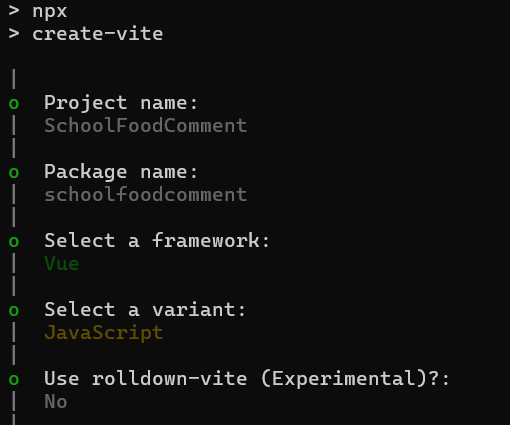
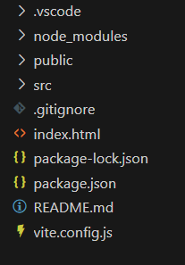
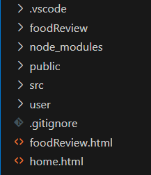
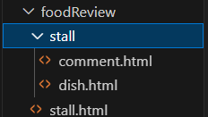
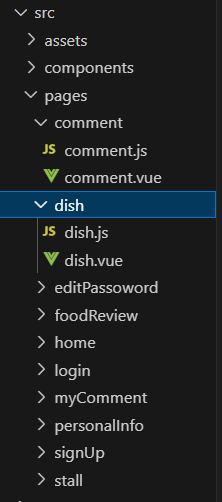
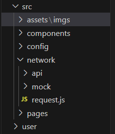
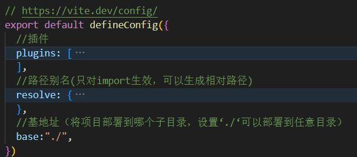
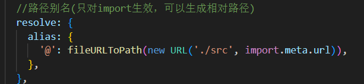
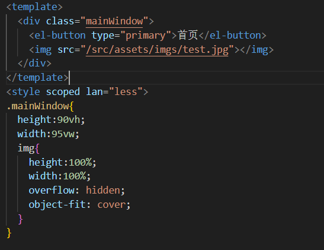

# 校园美食点评网站前端项目介绍

## 项目创建配置选项

**使用nodejs版本：v22.19.0**

**创建项目:**使用JS不使用TS，不使用rolldown-vite

```
npm create vite@latest
```




## 项目初始结构介绍




- **.vscode:**vscode的配置文件，不用管它

- **node_modules文件夹**：存储项目所使用到的包，无需上传到仓库

- **package.json文件**：用于配置项目的依赖，比如包、脚本等

- **package-lock.json文件**：node_modules中文件结构的快照，表示具体的包依赖树

- **vite.config.js:**项目开发时的配置文件（使用哪些工具、插件）

- **.gitignore:**配置哪些文件无需被git管理（git会自动忽略它们）

	

**PS**：上传gitHub时，无需上传node_modules文件夹，只要上传package.json和package-lock.json，因为二者是包依赖树的配置文件，然后执行以下代码即可自动下载相应的包。

```
npm install 
```


## **项目组织结构介绍**

### 解决网络资源路径（URL）与本地文件路径之间映射的问题

- **网络资源路径!=本地文件路径**

- **一般情况下，服务器会直接以当前目录作为根路径来翻译网络资源路径**

**比如**：浏览器访问：“https://ljysb/user/login”,服务运行在本地路径:"D:/project/",那么服务器就会去"D:/project/user/login"中找文件

- **为什么使用静态映射表很麻烦**

```html
<!--一个img盒子-->

```

**这里”./src/imgs/Amiya.jpg中的“.”不是指当前html文件所在的文件路径，而是浏览器访问的资源路径**

**比如**：浏览器当前访问”“https://ljysb/user/login”,那么上面的src就会是"user/login/src/imgs/Amiya.jpg"

如果我们将返回了网络路径映射为”/home/login",仍然返回文件路径"/user/login"文件

那么src就会是"home/src/imgs/Amiya.jpg"(错误的资源路径)，本来应该是”user/login/src/imgs/Amiya.jpg"

**这样我们就要为所有资源配置映射表，或者在html文件中加上\<base\>标签覆盖其原来的计算规则**

**（如果使用base标签会破坏我们项目灵活部署的优势，每次更换部署子目录都要修改base标签）**

- **本次项目的组织形式**





**我们按照网络资源路径的结构，来组件文件资源路径(放置html文件)**

**比如**：浏览器访问/foodReview/stall也没，我本在本地就可以查找"/foodReview/stall"和网络资源路径一致



**我们把每个html文件所需的js和vue文件，放在/src/pages/中**


### 项目资源组织




- **component：放自定义组件**
- **config：放配置文件（是否使用mock，哪些页面特殊，用户默认信息）**
- **network：放网络相关的模块**
- **network/api：放业务级api**
- **network/mock：放mock文件（模拟后端响应，仅开发阶段使用）**
- **request.js：封装的网络请求函数**


## 项目特殊配置

### base配置（这个问题还没有搞定）

- **base设置为绝对路径的作用**：配置网络资源的根地址

**比如服务器部署在"D:/project/server/"**中，那么服务的根地址就是”D:/project/server/”
**项目的文件可能部署在根目录下**："D:/project/index.html"
**也可能部署在子目录下**："D:/project/subDic/index.html"
**这时就需要设置baes：”/subDic/"**,以校准资源的访问


- **base设置为”./"的作用**：所有资源访问使用相对路径（这样不管项目文件放在哪个目录都没问题，我们这次使用这种）

	


### import路径别名



- **将’@’换成vite.config.js所处目录下的，src文件夹**

```javascript
import myComponet from "@/abc.vue"    
import myComponet from "/src/abc.vue"   //vite会自动将上面替换为下面（只对js中的import生效）
```


## 工具介绍

### element-plus（UI组件库）

#### 安装element-plus

安装element-plus(--save参数表示**生产环境**和**开发环境**都安装)

```
npm install element-plus --save
```

#### 安装自动导入插件(详见官网)

```
 npm install -D unplugin-vue-components unplugin-auto-import
```

```javascript
import { defineConfig } from 'vite'
import AutoImport from 'unplugin-auto-import/vite'
import Components from 'unplugin-vue-components/vite'
import { ElementPlusResolver } from 'unplugin-vue-components/resolvers'

export default defineConfig({
  // ...
  plugins: [
    // ...
    AutoImport({
      resolvers: [ElementPlusResolver()],
    }),
    Components({
      resolvers: [ElementPlusResolver()],
    }),
  ],
})
```

- **AutoImport**： 自动导入JS模块（扫描单文件组件的script部分）
- **Componets**：自动导入vue单文件组件（扫描单文件组件template部分）
- **ElementPlusResolver**：解析器（解析代码，判断需要导入什么vue组件或js模块）

**PS**：

- **-D**：表示开发环境依赖，即我们只需要在开发环境下使用该包（生产环境不需要）
- **-save**：表示开发环境和生产环境都需要


### axios

 **axios是一个http网络请求库**

 ```
 npm install axios --save
 ```

### mockjs

**mockjs可以拦截网络请求，方便前端独立调试网络接口**

```
npm install mockjs -D
```

### less

**less是CSS的一种扩展，允许在写样式表时嵌套写父子组件的样式表，让样式表组织更整洁**

```
npm install less --save
```



**使用less时只要在style标签的len属性写上”less"即可**（看个人喜好，可用可不用）
